# Project -2 Time Series Project
0. [Orden de los archivos](#schema0)
1. [Importar librerías ](#schema1)
# a.- Análisis del precio de cierre de las acciones y del volumen de operaciones
2. [Hacemos un dataframe con las datos de las compañías.](#schema2)
3. [Obtenemos la lista de los nombres de las compañías que vamos a analizar.](#schema3)
4. [Hacemos un gráfico con los valores de cierre.](#schema4)
5. [Analicemos el volumen total de acciones que se negocian cada día](#schema5)
# b.- Analizamos la devoluciones diarias

# c.- Análisis de la realización de multivariante

# d.- Análisis de valor en riesgo

13. [Análisis de valor en riesgo para Apple](#schema13)

# 0. Orden de los archivos

1º Stock-Price_EDA = a
2º Analyzing_Daily_retunrs = b
3º Performing_Multi-Variate = c y d

# 1. Importar librerías

~~~python
import pandas as pd
import numpy as np
import matplotlib.pyplot as plt
import seaborn as sns
~~~

# 2. Hacemos un dataframe con las datos de las compañías.

~~~python
path='./data'
company_list = ['AAPL_data.csv', 'GOOG_data.csv', 'MSFT_data.csv', 'AMZN_data.csv']
all_data = pd.DataFrame()

for file in company_list:
    current_df = pd.read_csv(path+"/"+file)
    all_data = pd.concat([all_data, current_df])
~~~
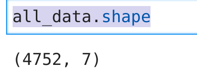
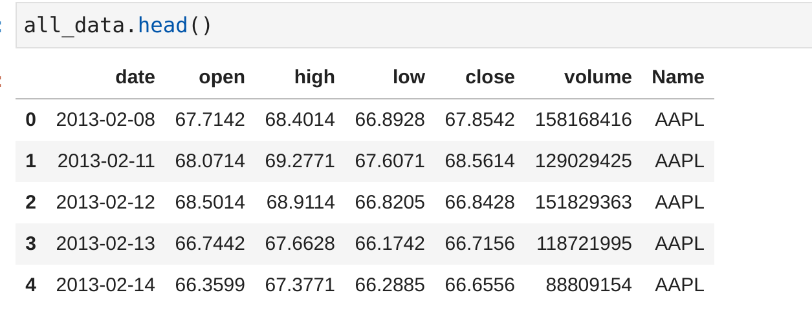

# 3. Obtenemos la lista de los nombres de las compañías que vamos a analizar.

~~~python
tech_list = all_data['Name'].unique()
~~~
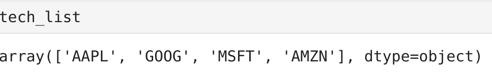

# 4. Hacemos un gráfico con los valores de cierre.

~~~python
plt.figure(figsize=(20,12))
for i, company in enumerate(tech_list,1):
    plt.subplot(2, 2, i)
    df=all_data[all_data['Name']==company]
    plt.plot(df['date'],df['close'])
    plt.title(company)
    plt.savefig(f"./images/{company}")
~~~

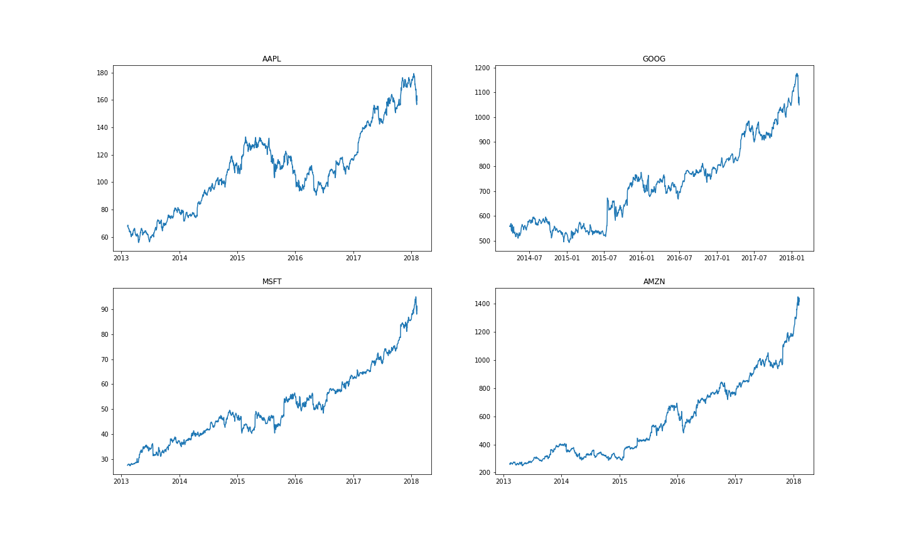

# 5. analicemos el volumen total de acciones que se negocian cada día

~~~python
plt.figure(figsize=(20,12))
for i, company in enumerate(tech_list,1):
    plt.subplot(2, 2, i)
    df=all_data[all_data['Name']==company]
    plt.plot(df['date'],df['volume'])
    plt.title(company)
    plt.savefig(f"./images/{company}_stock")
~~~
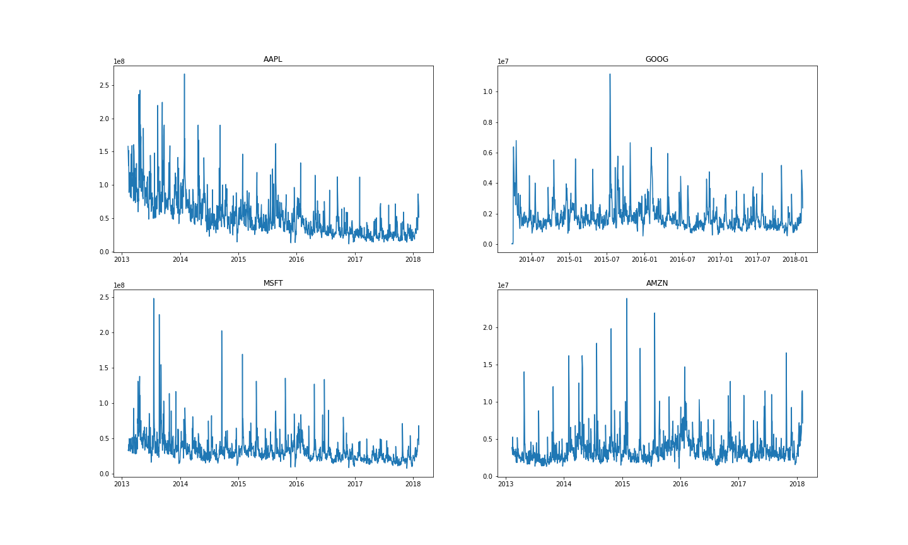

# 6. Importamos las librerías y cargamos el data set

~~~python
import pandas as pd
import numpy as np
import matplotlib.pyplot as plt
import seaborn as sns
df=pd.read_csv('./data/AAPL_data.csv')
~~~
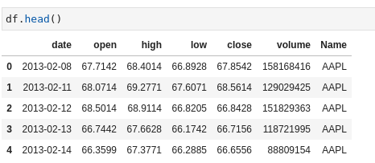

# 7. Como no tenemos el precio diario se calcula, después lo ponemos en porcentajes y los dibujamos
~~~python
df["daily_change_price"] = df["close"]- df["open"]
~~~
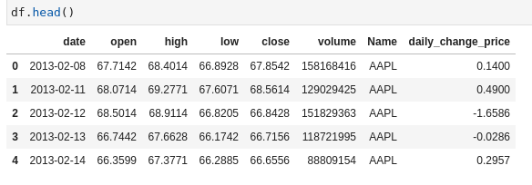
~~~python
df['1day % return']=((df['close']-df['open'])/df['close'])*100
df.head()
~~~
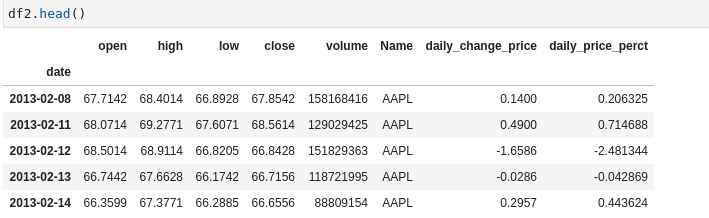

~~~python
plt.figure(figsize=(10,6))
df['daily_price_perct'].plot()
plt.savefig("./images/price_perct")
~~~
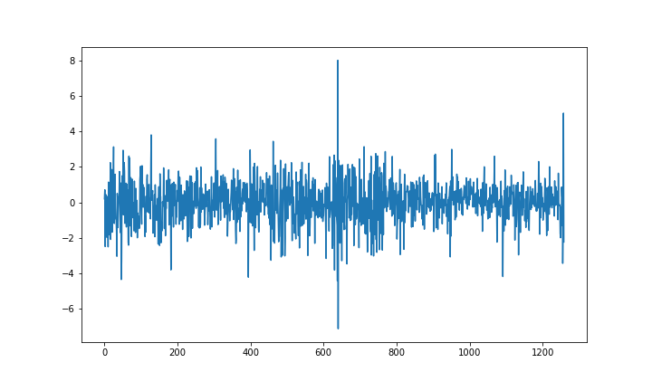

Para obtener unos datos de unos días en concreto

~~~Python
df.set_index('date')['2016-01-01':'2016-03-31']['daily_price_perct'].plot()
plt.xticks(rotation='vertical')
plt.savefig("./images/date.png")
~~~
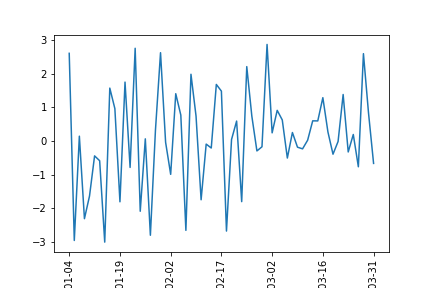

# 7. Analizar la media mensual de la columna de cierre
1º Hacemos un a copia del dataset
~~~python
df2=df.copy()
~~~

2º Convertimos los datos `date` como `datatime` porque eran  `object` y lo hacemos el índice del dataset
~~~python
df2.dtypes
~~~
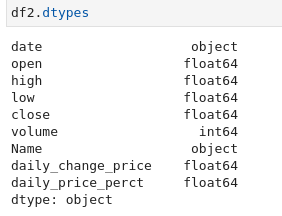

~~~python
df2['date']=pd.to_datetime(df2['date'])
df2.set_index('date',inplace=True)
~~~

3º Remuestrear los datos del dataset basados en meses
~~~python
df2['close'].resample('M').mean().plot()

~~~
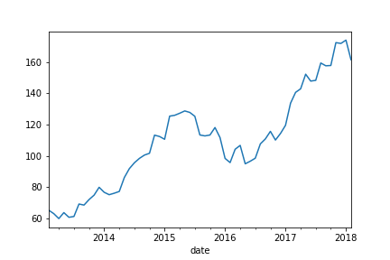

4º Remuestrear los datos del dataset basados en años
~~~python
df2['close'].resample('Y').mean().plot(kind = 'bar')
~~~
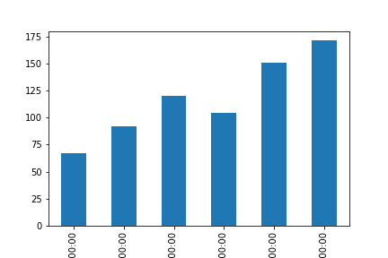

# 8. Creamos un dataset para cada empresa que vamos a anlizar
~~~python
aapl=pd.read_csv('./data/AAPL_data.csv')
goog=pd.read_csv('./data/GOOG_data.csv')
amzn=pd.read_csv('./data/AMZN_data.csv')
msft=pd.read_csv('./data/MSFT_data.csv')
~~~

# 9. Creamos un dataset con las ventas finales

~~~python
close['aapl']=aapl['close']
close['goog']=goog['close']
close['amzn']=amzn['close']
close['msft']=msft['close']

~~~
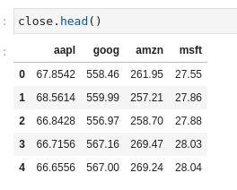

# 10. Hacemos un pairplot y heatmap.
Para ver la distribución de los datos con varibles 

~~~python
sns.pairplot(data=close)
plt.savefig("./images/close.png")
~~~
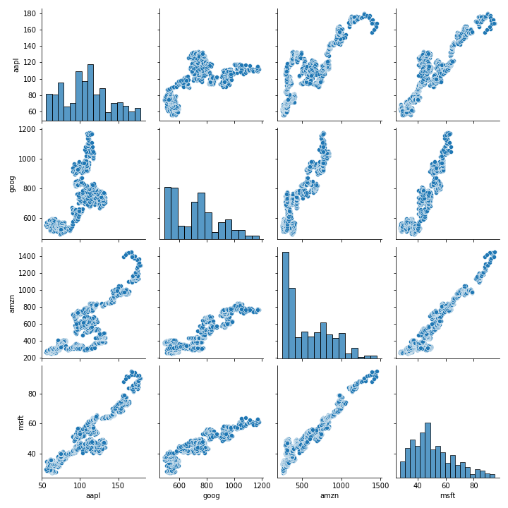
Dibujar y comrpobar la correlación

~~~python
sns.heatmap(close.corr(),annot=True)
~~~
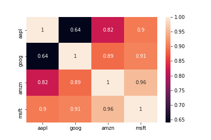

Donde podemos observar que las ventas de `amazon` y `microsoft` esta correladas con `0.96`

# 11. Creamos un dataset con los porcentajes de los precios diarios.
~~~python
data['appl_change']=((aapl['close']-aapl['open'])/aapl['close'])*100
data['goog_change']=((goog['close']-goog['open'])/goog['close'])*100
data['amzn_change']=((amzn['close']-amzn['open'])/amzn['close'])*100
data['msft_change']=((msft['close']-msft['open'])/msft['close'])*100
~~~
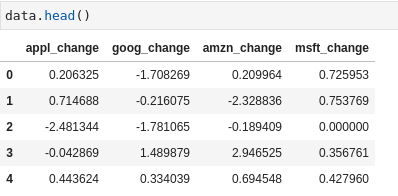

# 12. Hacemos un pairplot y heatmap.

~~~python
sns.pairplot(data = data)
plt.savefig("./images/data.png")
~~~

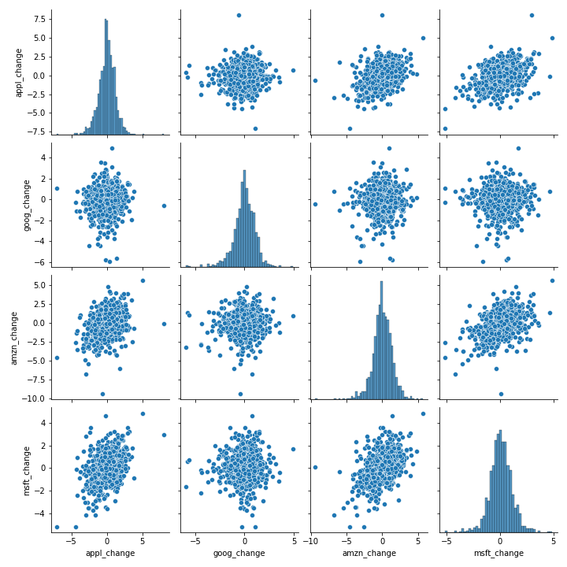

~~~python
sns.heatmap(data.corr(), annot = True)
plt.savefig("./images/data_corr.png")
~~~

# 13. Análisis de valor en riesgo para Apple
~~~python
sns.distplot(data['appl_change'])
~~~
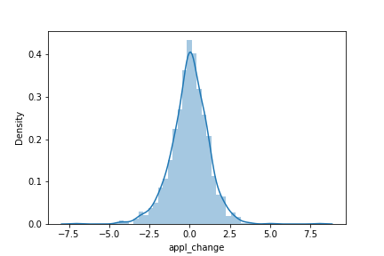

Calculamos la desciación estandar. 
~~~python
data['appl_change'].std()
data['appl_change'].quantile(0.1)
~~~

~~~python
data.describe()
~~~
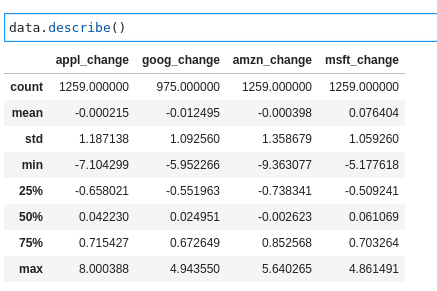

https://drive.google.com/drive/u/0/folders/10owYwrtRQIRCawOFgZy1qY7gG3ta8VfS