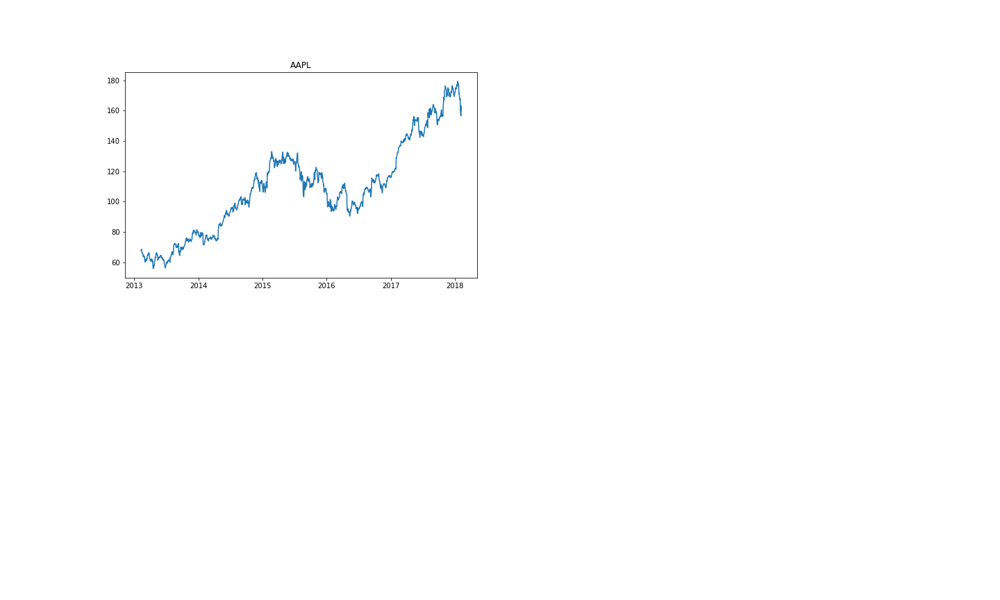
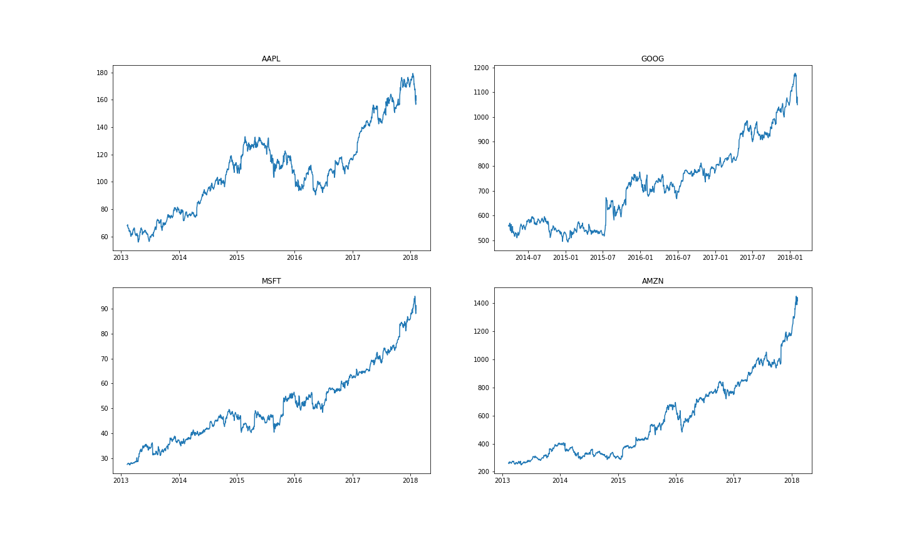
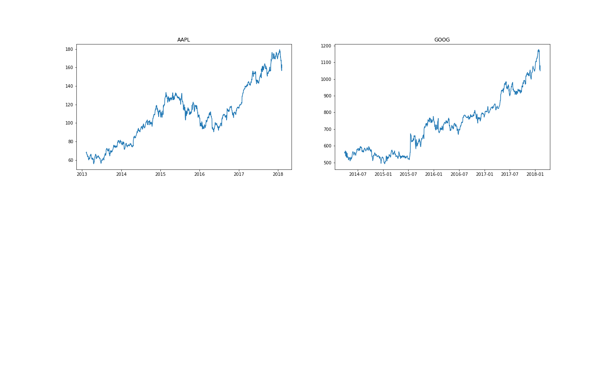
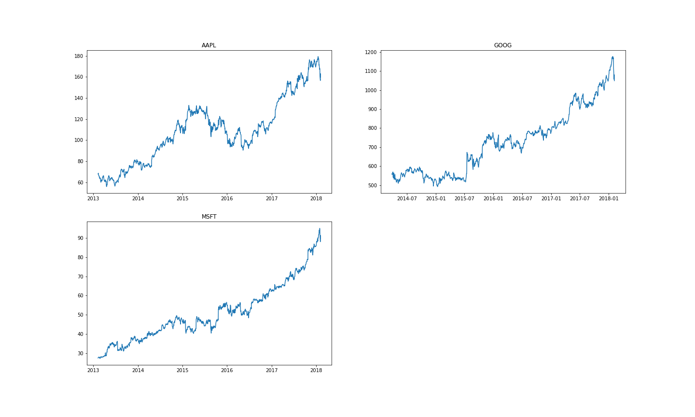
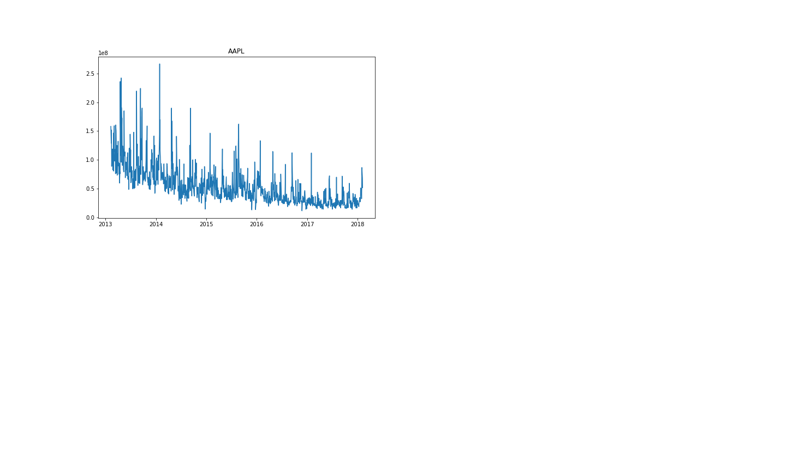
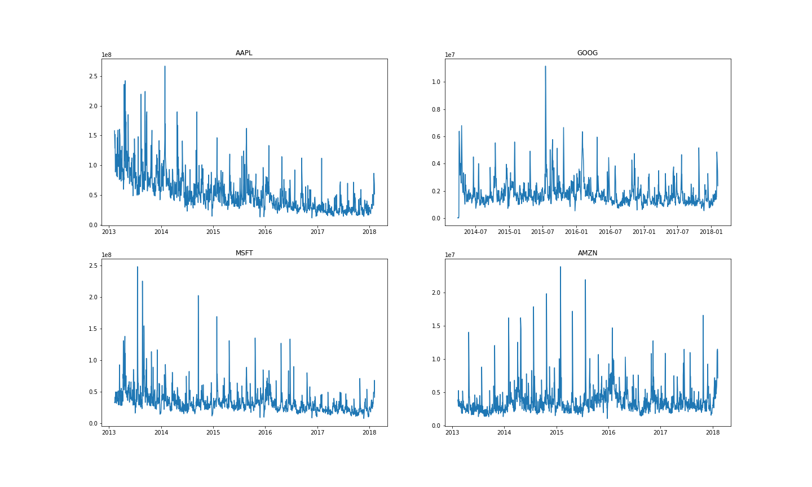
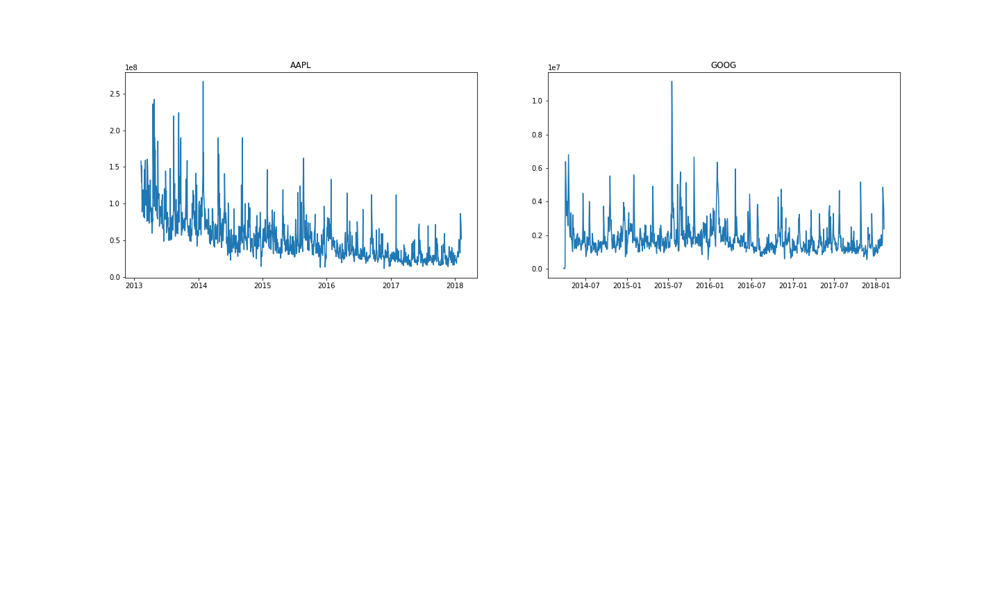
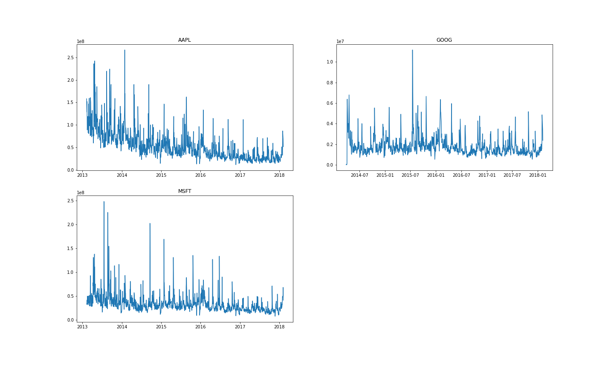

# Project -2 Time Series Project

1. [Importar librerías ](#schema1)
# a.- Analyzing Closing Price of Stocks& Volume Trading
2. [Hacemos un dataframe con las datos de las compañías.](#schema2)
3. [Obtenemos la lista de los nombres de las compañías que vamos a analizar.](#schema3)
4. [Hacemos un gráfico con los valores de cierre.](#schema4)
5. [Analicemos el volumen total de acciones que se negocian cada día](#schema5)

# 1. Importar librerías

~~~python
import pandas as pd
import numpy as np
import matplotlib.pyplot as plt
import seaborn as sns
~~~

# 2. Hacemos un dataframe con las datos de las compañías.

~~~python
path='./data'
company_list = ['AAPL_data.csv', 'GOOG_data.csv', 'MSFT_data.csv', 'AMZN_data.csv']
all_data = pd.DataFrame()

for file in company_list:
    current_df = pd.read_csv(path+"/"+file)
    all_data = pd.concat([all_data, current_df])
~~~

# 3. Obtenemos la lista de los nombres de las compañías que vamos a analizar.

~~~python
tech_list = all_data['Name'].unique()
~~~

# 4. Hacemos un gráfico con los valores de cierre.

~~~python
plt.figure(figsize=(20,12))
for i, company in enumerate(tech_list,1):
    plt.subplot(2, 2, i)
    df=all_data[all_data['Name']==company]
    plt.plot(df['date'],df['close'])
    plt.title(company)
    plt.savefig(f"./images/{company}")
~~~

# 5. analicemos el volumen total de acciones que se negocian cada día

~~~python
plt.figure(figsize=(20,12))
for i, company in enumerate(tech_list,1):
    plt.subplot(2, 2, i)
    df=all_data[all_data['Name']==company]
    plt.plot(df['date'],df['volume'])
    plt.title(company)
    plt.savefig(f"./images/{company}_stock")
~~~

https://drive.google.com/drive/u/0/folders/10owYwrtRQIRCawOFgZy1qY7gG3ta8VfS